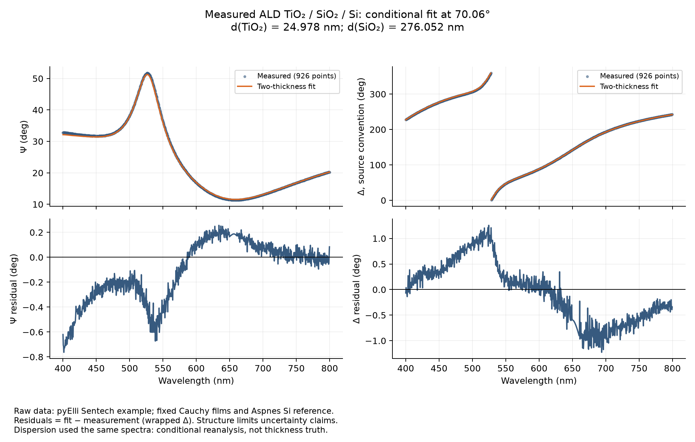
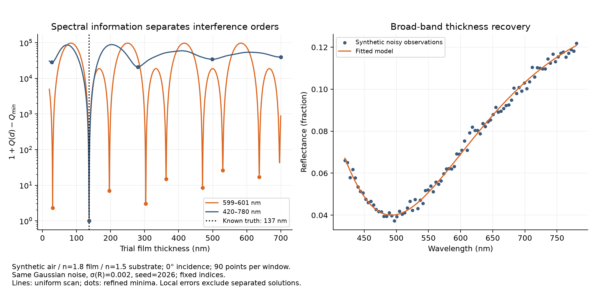
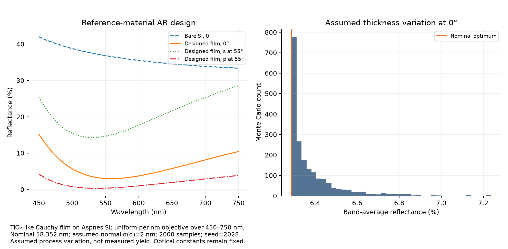

# Thin-Film Optical Metrology and Tolerance Design

Infer film thickness from optical spectra, expose non-unique solutions, and propagate
assumed coating-thickness variation into optical performance.

[](https://github.com/Atabrahim/thin-film-optical-metrology/actions/workflows/ci.yml)
[](LICENSE)



**A good-looking fit is not proof of a unique measurement.** This project combines
a stable polarized forward solver, bounded thickness inference, identifiability
diagnostics and a reproducible antireflection tolerance study. It is scientific
research/portfolio software, not a calibrated instrument or qualified process tool.

## Scientific problem and features

Interference changes reflected amplitude and phase. These changes carry thickness
information, but different interference orders, correlated thicknesses and uncertain
optical constants can produce similar spectra. The software asks both *which thickness
fits?* and *what does the information support?*

- Coherent s/p multilayer amplitudes, power R/T, finite-stack absorption and Psi/Delta.
- Passive complex indices, Cauchy dispersion and bounded reference-table interpolation.
- One/two-thickness multistart inference, residuals, covariance, correlations,
  rank/bound warnings and competing-minimum diagnostics.
- Measured ALD TiO2/SiO2/Si reanalysis with provenance and model-sensitivity refits.
- Synthetic ambiguity/recovery studies and seeded coating tolerance propagation.
- Python API, JSON-driven CLI, CSV/JSON reports, figures and a focused Streamlit demo.

## Example results

| Case | Reproduced result | Interpretation |
| --- | --- | --- |
| Measured ellipsometry | 24.978 nm TiO2; 276.052 nm SiO2 | Conditional on fixed dispersion; no certified truth |
| Measured parameter correlation | −0.951 | Strong trade-off; structured residuals limit iid errors |
| Synthetic broad spectrum, truth 137 nm | 136.785 nm; local standard error 0.153 nm | Known Gaussian noise σ(R)=0.002 |
| Synthetic 599–601 nm window | Competing fits near 29.79, 136.88 and 303.55 nm | Small local error does not establish uniqueness |
| Model coating on reference Si | 58.352 nm; mean R 6.288% vs bare 36.146% | Uniform-per-nm objective, 450–750 nm, 0° incidence |
| Assumed 2 nm process standard deviation | 2.5–97.5 percentiles of mean R: 6.288–6.789% | Simulated distribution, not measured yield |




The measured study uses 926 of 1,227 rows inside 400–800 nm, without smoothing or
outlier deletion. Psi/Delta RMSE is 0.261°/0.588°. Local iid errors of 0.015/0.026 nm
**are not calibrated physical uncertainties**: residuals are correlated and the source
fitted the fixed TiO2 dispersion to the same data. See [model sensitivity](results/model_sensitivity.png),
[numeric report](results/report.json) and [case interpretation](docs/CASE_STUDIES.md).

## Physics and numerical methods

For time dependence exp(−iωt), passive index is N=n+ik with k≥0. The longitudinal
optical index and propagation factor are

\[
q_j=\sqrt{N_j^2-N_0^2\sin^2\theta_0},\qquad
P_j=\exp(2\pi i q_j d_j/\lambda).
\]

Wavelength λ and thickness d use nm; indices are dimensionless; API angles use degrees.
The passive branch gives decaying waves. Fresnel interfaces combine by stable multiple-
reflection recursion without growing exponentials. Transmission is **power entering the
semi-infinite substrate**, not light exiting the back of a finite wafer.

Our API uses `rho = r_p/r_s = tan(Psi) exp(+i Delta)`. The measured source uses the
opposite Delta sign: the workflow converts it explicitly and retains raw values.
Inference uses bounded least squares, wrapped phase residuals, central differences
and SVD covariance. Multistart/objective scans examine separated minima. Design uses
grid search plus bracket refinement, trapezoidal integration and Monte Carlo propagation.

See [forward equations](docs/MODEL.md), [inference](docs/INFERENCE.md) and
[tolerancing](docs/TOLERANCING.md) for definitions and validity limits.

## Installation

Python 3.11+. Commands use a POSIX shell. The checkout contains data/examples/reports;
the wheel contains the reusable Python package.

```bash
git clone https://github.com/Atabrahim/thin-film-optical-metrology.git
cd thin-film-optical-metrology
python -m venv .venv
source .venv/bin/activate
python -m pip install ".[plots]"
```

## Usage

Reproduce all cases, CSV/JSON reports and four figures:

```bash
thinfilm examples/case_study.json --output outputs/reproduced
```

The JSON fixes seed, sample count and input paths. Its paths resolve relative to the
JSON file; `--output` resolves relative to the current directory. Existing output files
with the same names are replaced. Numeric-only execution:

```bash
python -m thinfilm.cli examples/case_study.json --output outputs/numeric --no-figures
```

Public API — ideal quarter-wave coating and synthetic thickness inference:

```python
import numpy as np
from thinfilm.optics import multilayer
from thinfilm.inference import fit_thickness

film_index = np.sqrt(1.5)
spectrum = multilayer([600.0], [1.0, film_index, 1.5], [600 / (4 * film_index)])
assert spectrum.R[0] < 1e-25

wavelength_nm = np.linspace(420, 780, 90)
synthetic_R = multilayer(wavelength_nm, [1, 1.8, 1.5], [137]).R
fit = fit_thickness(wavelength_nm, [1, 1.8, 1.5], [100], [0], [[20, 250]],
                    synthetic_R, sigma=0.002, absolute_sigma=True)
print(fit.thickness_nm, fit.flags)
```

Interactive synthetic demonstration:

```bash
python -m pip install ".[app]"
streamlit run examples/app.py
```

Change thickness/angle and compare single-colour with broad-spectrum information.
No experimental calibration is implied.

## Validation and development

Independent checks include analytical Fresnel/quarter-wave limits, lossless energy
balance, TIR, opaque-film stability and 30 random stacks against `tmm` 0.2.0.
Inference tests use independent Airy-formula and `tmm` observations, noisy known-truth
recovery, Fisher covariance, identical-index degeneracy and active bounds. Design tests
check quadrature/grid convergence. Measured agreement is reported separately.

```bash
python -m pip install ".[dev,app]"
python -m pytest -q
ruff check src tests examples
ruff format --check src tests examples
python -m build
```

See [validation and release checks](docs/VALIDATION.md). Tables are deterministic for
the declared seed/environment. Cross-platform floating-point/raster differences can occur;
compare numerical tolerances rather than requiring identical PNG bytes.

## Project structure

| Path | Role |
| --- | --- |
| `src/thinfilm/` | Optics, materials, import, inference, tolerance, workflow and CLI |
| `tests/` | Independent scientific, failure-case and integration checks |
| `data/` | Measurements, reference constants, licences and provenance |
| `examples/` | JSON configuration and interactive demo |
| `results/` | Archived reports, tables and visually inspected figures |
| `docs/` | Science, validation, learning notes and recovery record |

## Assumptions, limitations and future work

Coherent, smooth, isotropic homogeneous planar films; nonabsorbing ambient; semi-infinite
substrate. No roughness, anisotropy, depolarization, incoherent backside reflection or
instrument response. Exact critical-angle singular limits are excluded. No reference
extrapolation; Cauchy assumes a transparent window. At most two thicknesses vary with
fixed indices. Finite searches do not prove global uniqueness. Local Gaussian errors
omit material uncertainty, calibration and model discrepancy. Tolerances are assumptions.

Future work: calibrated thickness/angle standards, optical-constant uncertainty,
roughness/incoherent optics and measured process distributions. These are outside V1.

## References and licensing

- S. J. Byrnes, [Multilayer optical calculations](https://arxiv.org/abs/1603.02720).
- D. E. Aspnes and A. A. Studna, [Phys. Rev. B 27, 985 (1983)](https://doi.org/10.1103/PhysRevB.27.985).
- [pyElli measured example](https://pyelli.readthedocs.io/en/latest/auto_examples/plot_02_TiO2_multilayer.html).
- [Pinned data revisions, hashes, licences and phase convention](data/PROVENANCE.md).

Original code: [MIT](LICENSE). Unmodified measured data retain the source repository
GPL-3.0 terms; the silicon table is CC0. No external solver code was copied.
Development and validation execution were AI-assisted. This does not establish that
the portfolio owner independently performed every derivation or test.
